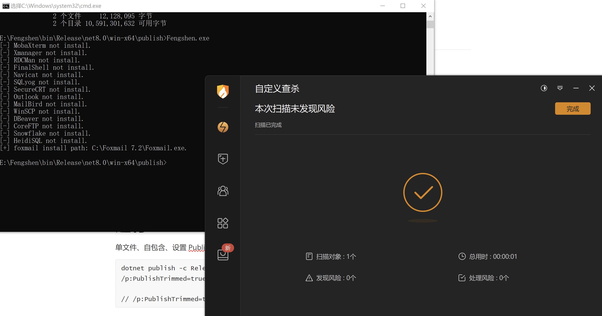

# Fengshen
从注册表中查询是否安装某应用。

## 目前支持查询以下应用
*注：只查是否安装，以及安装目录，不解密*

* MobaXterm, Xmanager, RDCMan, FinalShell, Navicat
* SQLyog, SecureCRT, Outlook, MailBird, WinSCP
* DBeaver, CoreFTP, Snowflake, HeidiSQL,foxmail


# 更新记录

```
2024-11-10 添加了检测foxmail是否登录过邮箱，如果存在就进行zip打包到工具运行目录下
```

# bypass

随便检测了下




# 运行

单文件、自包含、设置 PublishTrimmed 去掉不必要的代码和依赖。
```
dotnet publish -c Release -r win-x64 --self-contained true /p:PublishSingleFile=true /p:PublishTrimmed=true

// /p:PublishTrimmed=true：启用 发布修剪，它会去除没有使用的程序集和资源，从而减小文件大小。
```


# 运行结果

```
[-] MobaXterm not install.
[-] Xmanager not install.
[-] RDCMan not install.  
[-] FinalShell not install.
[-] Navicat not install.
[-] SQLyog not install.
[-] SecureCRT not install.
[-] Outlook not install.
[-] MailBird not install.
[-] WinSCP not install.
[-] DBeaver not install.
[-] CoreFTP not install.
[-] Snowflake not install.
[-] HeidiSQL not install.
[+] foxmail install path: C:\Foxmail 7.2\Foxmail.exe.
```

